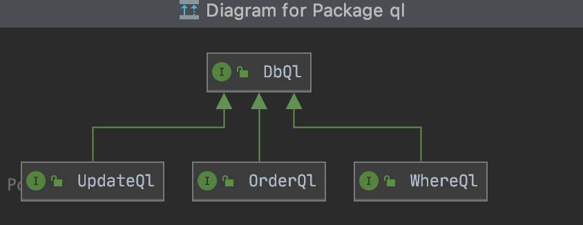
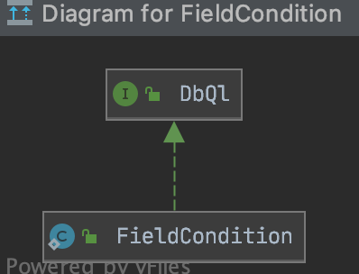

sprlikemongo
==

依赖spring-data-mongodb提供的mongoTemplate

## 介绍
声名式MongoDB数据库操作API

## 类图




所有操作都是围绕DbQl语句，入口类：`DbWhere`，`DbUpdate`，`DbOrder`，`DbAndOr`

## 使用

引入依赖
```
 <dependency>
    <groupId>org.springframework.data</groupId>
    <artifactId>spring-data-mongodb</artifactId>
    <version>${version}</version>
 </dependency>
```
## 例子
- select

```java
mongoExecutor.search(1, 10, User.class,DbWhere.name("adCode").eq("1112"), DbWhere.name("cityKey").eq("10010"))
```

- update
```java
mongoExecutor.update(User.class, DbWhere.name("_id").eq(3), DbUpdate.name("birthday").eq("2000-10-1"));
```
- delete
```java
 mongoExecutor.del(User.class, DbWhere.name("_id").eq(2));
```

- 复杂查询1
```java
	List<User> list = mongoExecutor.list(0, 10, User.class,
                DbAndOr.operator(() -> Lists.newArrayList(DbWhere.name("_id").eq(3))),
                DbAndOr.operator(() -> Lists.newArrayList(DbWhere.name("_id").eq(3),
    DbWhere.name("adCode").eq(1111)),
		() -> Lists.newArrayList(DbWhere.name("_id").eq(4))));

// 对应的MongoDB query语句
// query: { "$and" : [ { "_id" : 3} , { "$or" : [ { "_id" : 3 , "adCode": 1111} , { "_id" : 4}]}]}

```

- 复杂查询2

```java
List<User> list = mongoExecutor.list(0, 10, User.class,
                DbWhere.name("adCode").eq(1111),
                DbAndOr.operator(() -> Lists.newArrayList(DbWhere.name("_id").eq(3))),
                DbAndOr.operator(() -> Lists.newArrayList(DbWhere.name("_id").eq(3),
                        DbWhere.name("adCode").eq(1111)),
                        () -> Lists.newArrayList(DbWhere.name("_id").eq(4))),
                DbAndOr.operator(() -> Lists.newArrayList(DbWhere.name("_id").eq(3),
                        DbWhere.name("adCode").eq(1111)),
                        () -> Lists.newArrayList(DbWhere.name("_id").eq(4))));
        System.out.println(">>>" + list);
// 对应的MongoDB query语句
// query: { "adCode" : 1111 , "$and" : [ { "_id" : 3} , { "$or" : [ { "_id" : 3 , "adCode" : 1111} , { "_id" : 4}]} , { "$or" : [ { "_id" : 3 , "adCode" : 1111} , { "_id" : 4}]}]}
```